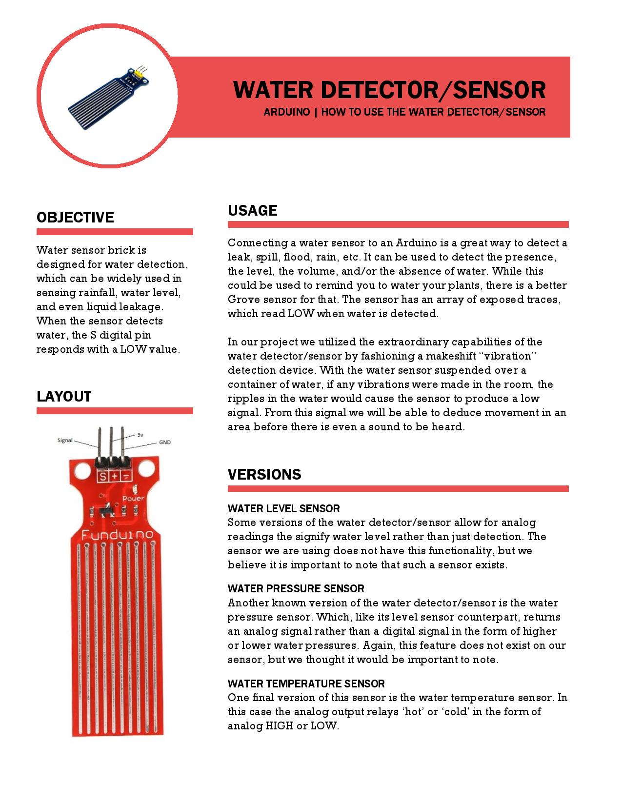
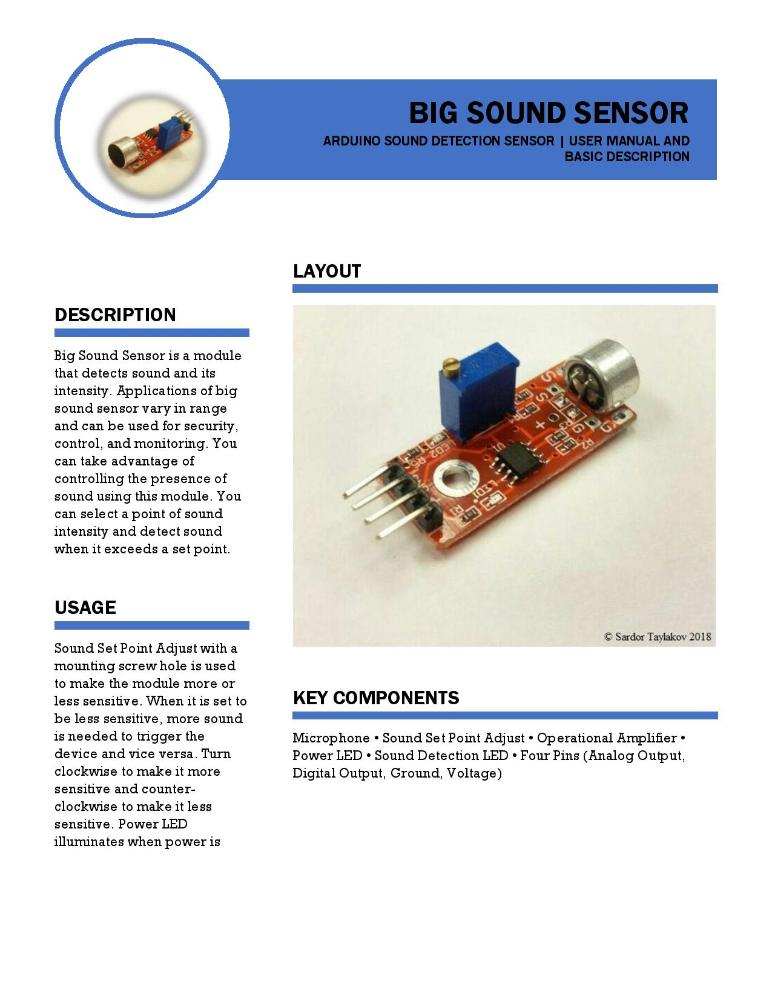
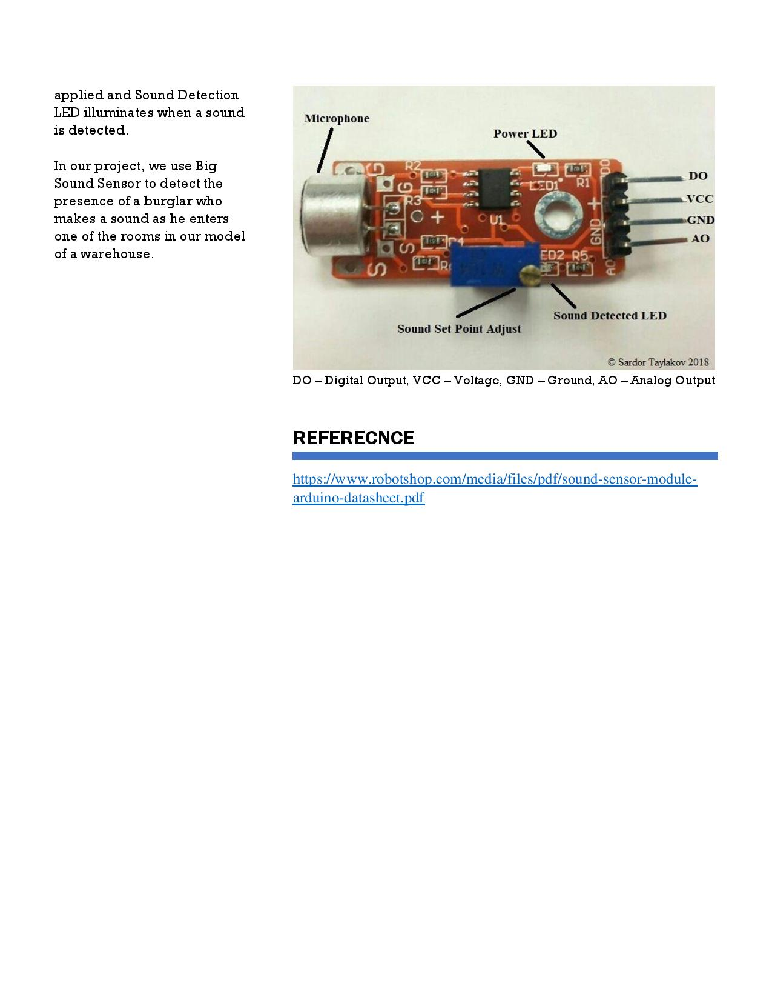

# Multi-Room-Security-System
The main purpose of this project was to develop a security system using two or more Arduino sensors. To accomplish this, we developed a software to allow a user (for example a security officer) to interact with a web interface through their browser in order to prime one or more Arduino sensors connected to Raspberry Pi's :apple:. Then, whenever a sensor is activated (for example, a burglar makes a noise in one of the rooms being monitored), the user will be notified by an alarm sound from their computer and a notification on their web interface of the room currently being accessed. The user can then deal with the intruder and then reset the system easily from that same web interface.

To test the functionality of our software, we practiced on a single Raspberry Pi connected to two Arduino sensors: Big Sound Sensor, and Water Detection Sensor. The following includes some background information on these sensors as well as how we used them to fulfill the purposes of our project.
## Sensors

## Web Interface
