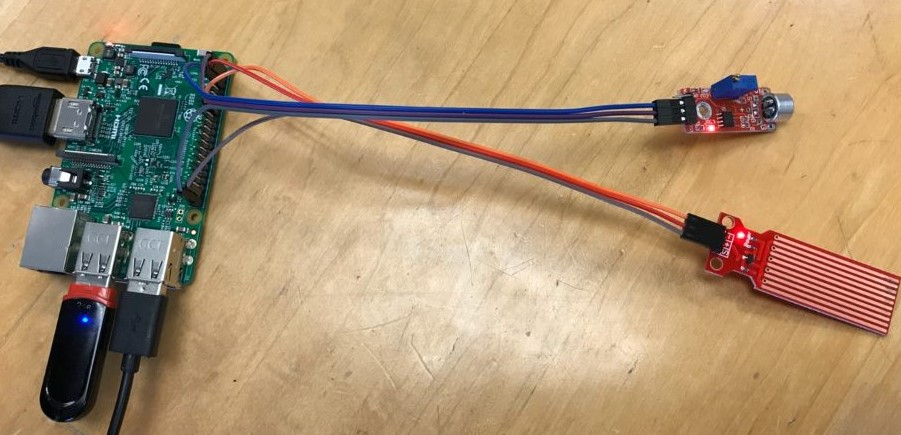
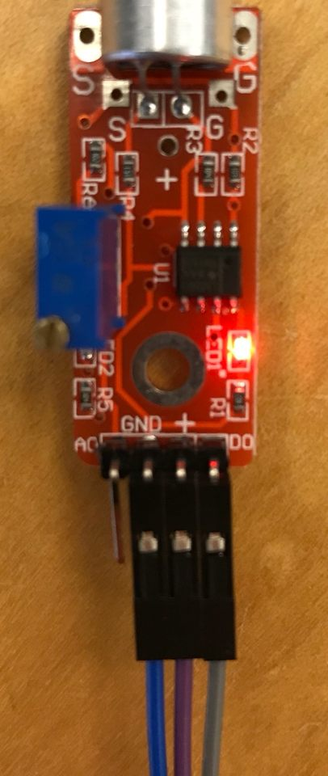
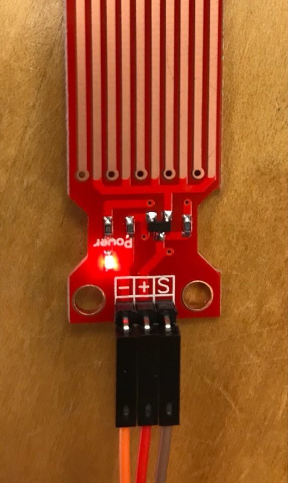
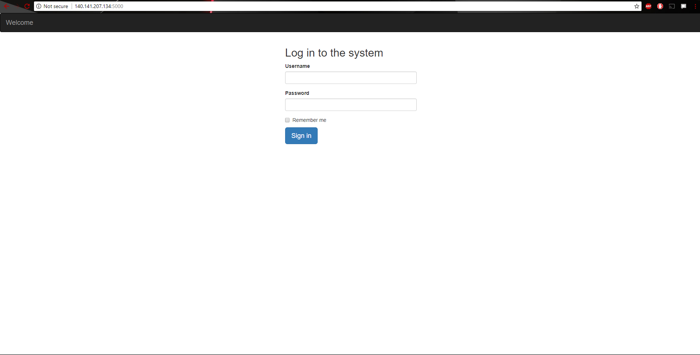
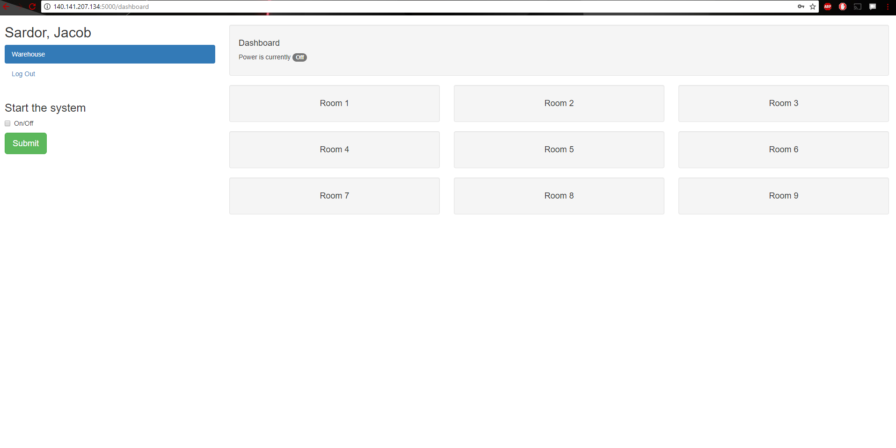
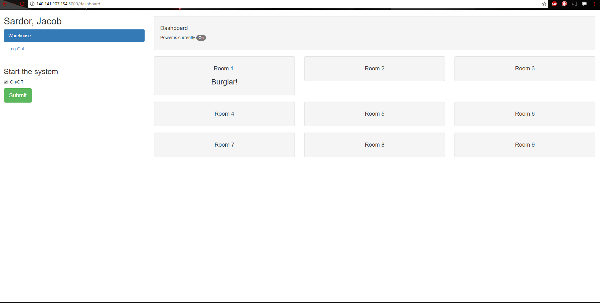

# Multi Room Security System Level 1 IoT
The main purpose of this project was to develop a security system using two or more Arduino sensors. To accomplish this, we developed a software to allow a user (for example a security officer) to interact with a web interface through their browser in order to prime one or more Arduino sensors connected to Raspberry Pi's :apple:. Then, whenever a sensor is activated (for example, a burglar makes a noise in one of the rooms being monitored), the user will be notified by an alarm sound from their computer and a notification on their web interface of the room currently being accessed. The user can then deal with the intruder and then reset the system easily from that same web interface.    

   
To test the functionality of our software, we practiced on a single Raspberry Pi connected to two Arduino sensors: Big Sound Sensor, and Water Detection Sensor. The following includes some background information on these sensors as well as how we used them to fulfill the purposes of our project.

## Sensors

## Web Interface
The user, a security officer for example, has to login to the system to turn it on and start surveilance. On clicking "Sign in", the user is redirected to the dashboard.    

The should now be on the dashboard. Note the 3x3 grid of room numbers on the right. This is meant to represent the 9 different rooms you can be monitoring. Because this is a template project, it is possible to alter the number of rooms without inhibiting the overall process of the software. There are also two user input buttons (on/off and submit). Pressing on/off means the user is ready to start the system. On pressing Submit, the sensors begin listening for sounds or vibrations.    

The system should now be active, and the sensors are now checking for intruders. If noise is made, the sound sensor will activate, and if the water sensor contacts water, the alarm will also activate and notify the security officer.    

We use two different sensors to demonstrate that Raspberry Pi's can be placed in different rooms and notify the user from different locations. In our case, Raspberry Pi's would be Internet of Things devices that exploit Fog Computing by running the application locally and sending a notice to the server that is hosted up on the Cloud. 
## Demo
Watch a demo here: https://www.youtube.com/watch?v=PqJlBJZ-FQw  
Make it yourself: https://www.instructables.com/id/IoT-Level-1-Template-Multi-Room-Security-System/
## Acknowledgements
* Jaimie Kelley, Assistant Professor at Denison University 
* Jacob von der Lippe, Denison Universtiry '19
